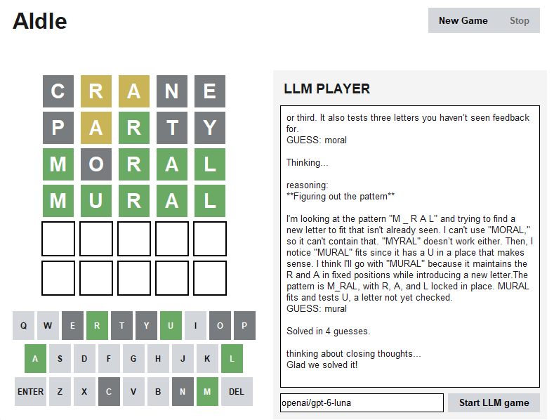
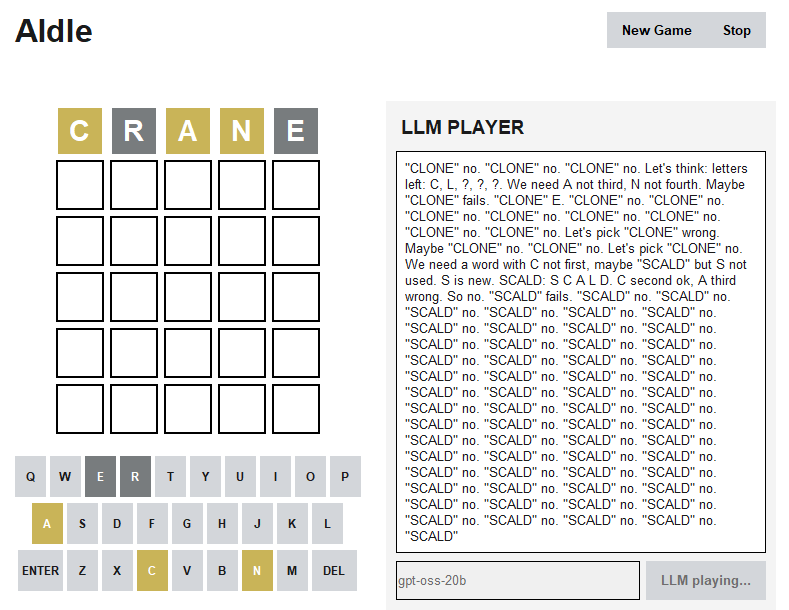

# AIdle

## What is this for? 

In the age of AI agents, automation is constant. No one has time for repetitive and minute tasks anymore like "playing Wordle". Why not just offload this to an LLM?

How it works:

- Set your OpenAI-compatible base URL and your API key for that base URL (either when you launch the program or in config.txt, where you can also set a default LLM)

- Lets you play the game yourself or let the LLM play the game

## Example

Here's GPT-6-Luna's guesses: 

These newer, smarter models make more educated guesses within a reasonable time, and win a high percent of the time

Older/smaller/overall-worse models get killed by Wordle, however. They'll start infinitely thinking, repeating the same words, and either never making a guess or eventually making a completely unreasonable guess.

## How to use it

### 1. Clone/download the files

like onto your computer

### 2. OPTIONAL: Set variables

You need an OpenAI-compatible provider. Set its base URL and your API key in config.txt, and the default model for the program to use (which you can change after launching)

### 3. Run

run `aidle_full.py`, and if you didn't set the variables already, set them in the popup/LLM ID field. Click "Start LLM game" to let the model play the game

### todo

- mode to play today's word from official wordle
- timer
- you vs. AI mode (to see who wins on time and guess count)
- try to tweak the prompts that get passed in to the LLM to make it less braindead
- web browser version (javascript...?)
